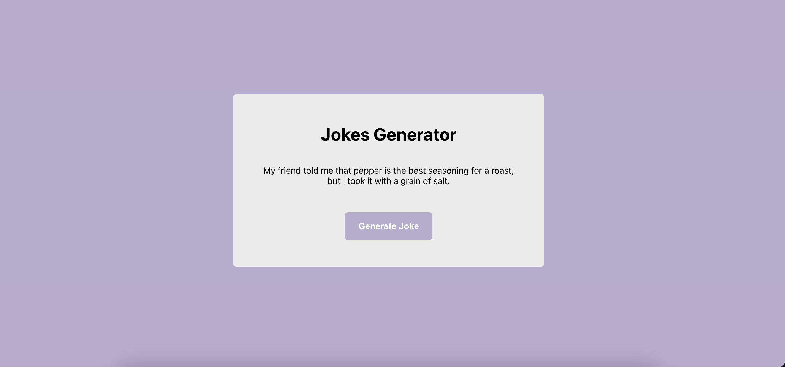

# Random Jokes Generator

Application that generates random jokes

## Technology used

React JS

## Features

- Generates joke
- Reponsiveness

## Mobile view

## To run the application

- Clone the project  
  `https://github.com/KavyaMVG/Random-joke-generator`

- Install dependencies  
  `npm install`  

- Run the project  
  `npm start`

## Author

### Development

Want to contribute? Great!

To fix a bug or enhance an existing module, follow these steps:

- Fork the repo
- Make the appropriate changes in the files
- Commit your changes (`git commit -m 'Message goes here'`)
- Push to the branch (`git push`)
- Create a Pull Request

### Bug / Feature Request

If you find a bug or to request a new feature, kindly open an issue [here](https://github.com/KavyaMVG/Random-joke-generator/issues/new).
